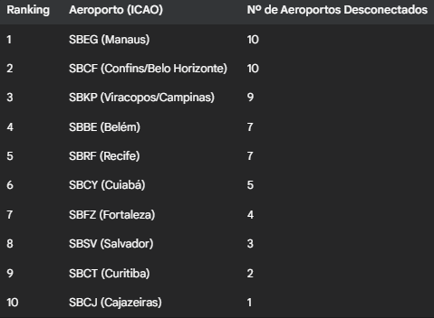
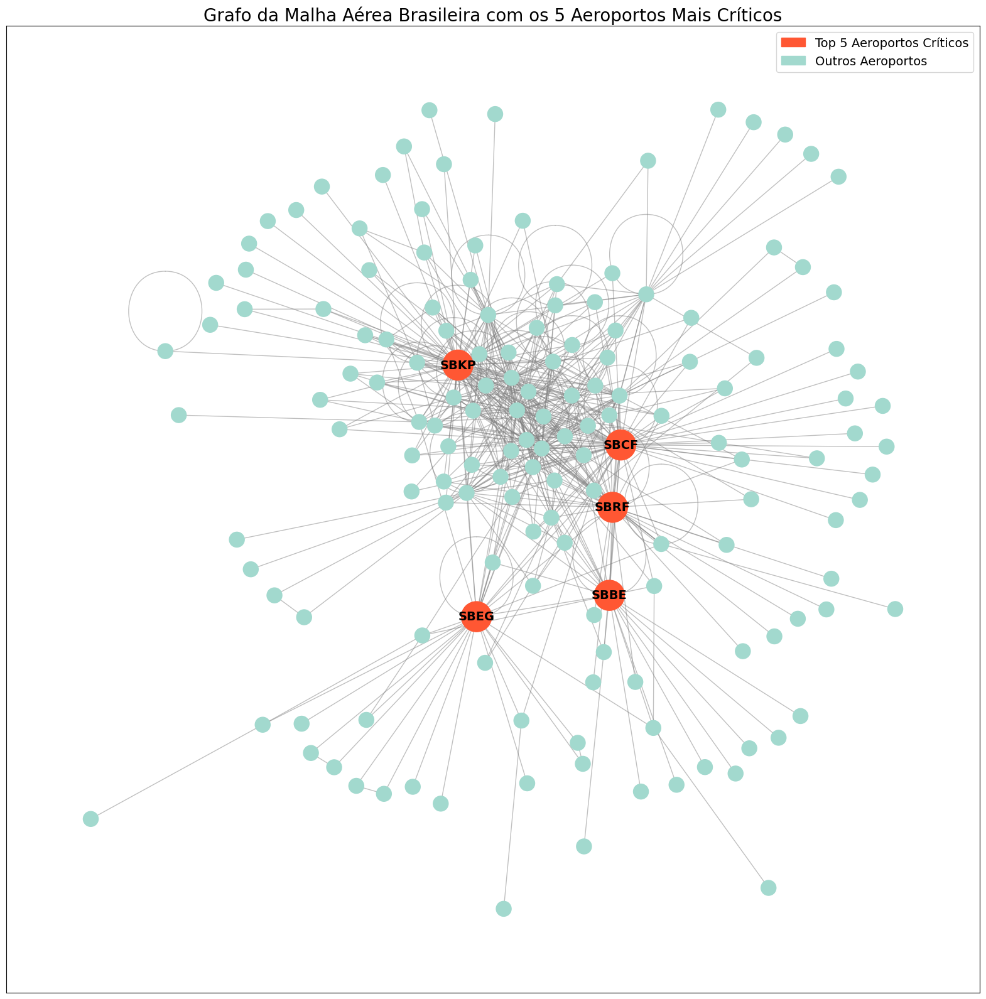

Análise de Resiliência da Malha Aérea Brasileira 
Autor: (Pedro Arthur da Luz Miranda) 
Data: 18/06/2025

# 1. Introdução e Objetivo
A malha aérea de um país de dimensões continentais como o Brasil é uma infraestrutura complexa e vital para a economia e a integração nacional. A interrupção de operações em um único aeroporto pode causar efeitos em cascata, gerando atrasos e cancelamentos em toda a rede.

Este projeto visa analisar a estrutura e a resiliência da malha aérea doméstica do Brasil, utilizando dados de voos da ANAC. O objetivo principal é identificar, através da teoria dos grafos, quais são os aeroportos mais críticos do país, ou seja, aqueles cuja ausência teria o maior impacto negativo na conectividade da rede como um todo.

# 2. Metodologia
Para realizar esta análise, a malha aérea foi modelada como um grafo não-direcionado, onde:

Nós (Vértices): Representam os aeroportos brasileiros.
Arestas (Ligas): Representam as rotas de voos diretos existentes entre os aeroportos.
A "criticalidade" de um aeroporto foi definida pelo impacto de sua remoção na integridade da rede. O método utilizado foi:

Construir o grafo completo com todos os aeroportos e rotas.
Isolar a maior "componente conectada" do grafo, que representa a malha aérea principal, ignorando pequenos aeroportos isolados.
Simular a remoção de cada aeroporto, um por vez.
Após cada remoção, calcular o número de aeroportos que se tornaram "órfãos", ou seja, que foram desconectados da malha principal.
O impacto de um aeroporto é o número de outros aeroportos que ele desconecta. Quanto maior o impacto, mais crítico é o aeroporto.
# 3. Resultados
A análise revelou que a malha aérea principal do Brasil é estruturalmente robusta, não possuindo "pontes" ou "pontos de articulação". Isso significa que a falha de um único aeroporto ou rota não é suficiente para dividir a rede em duas partes isoladas. No entanto, a rede depende fortemente de alguns aeroportos-chave para manter sua coesão.

## Ranking de Aeroportos Críticos
A tabela abaixo classifica os 10 aeroportos mais críticos com base no número de outros aeroportos que seriam desconectados da malha principal caso eles fossem removidos.

## O grafo a seguir ilustra a estrutura da malha aérea. 
Os 5 aeroportos mais críticos foram destacados em vermelho para evidenciar sua centralidade e importância na rede.

# 4. Discussão e Conclusão
Os resultados mostram que a criticidade de um aeroporto não está ligada apenas ao seu volume de passageiros, mas principalmente ao seu papel conector na rede.

Manaus (SBEG) e Belém (SBBE) emergem como extremamente críticos por funcionarem como os principais portões de entrada e saída da vasta Região Norte, conectando inúmeras cidades menores ao resto do país.
Confins (SBCF) e Viracopos/Campinas (SBKP) destacam-se como grandes centros de distribuição de voos (hubs), não apenas para suas regiões metropolitanas, mas para todo o Brasil. A remoção deles cria um "vácuo" que dificulta a conexão entre o Sudeste e outras regiões.
Recife (SBRF) cumpre um papel similar como um hub vital para a Região Nordeste.
Conclui-se que, embora resiliente a falhas únicas, a malha aérea brasileira possui uma dependência acentuada de um pequeno conjunto de aeroportos-chave que garantem a sua coesão. Investimentos na descentralização e na criação de rotas alternativas que não passem por esses hubs poderiam aumentar ainda mais a resiliência e a eficiência do transporte aéreo nacional.

### Fonte:
Dados da ANAC relativo ao mês de novembro de 2024: [anac_flights2024](https://siros.anac.gov.br/siros/registros/diversos/vra/2024/)